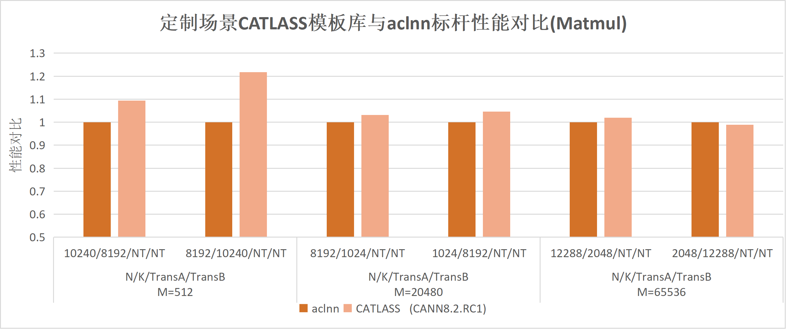
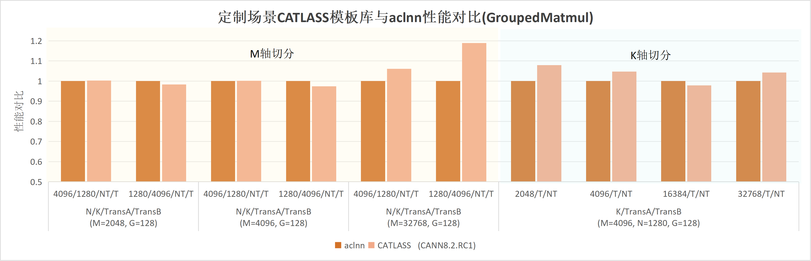

# CATLASS

---

## ⚠ 重要变更

我们于2026年3月第一次社区会议正式确定CATLASS社区主线将开始新增对下一代昇腾硬件Ascend 950PR/Ascend 950DT的支持。为在不同平台区分底层接口的实现，该新增支持将引入新的编译宏，用户需要注意在对应编译命令中进行相应适配。

- 新增宏：`CATLASS_ARCH`，用于指定目标架构。其取值可在[SIMD BuiltIn关键字](https://www.hiascend.com/document/detail/zh/CANNCommunityEdition/900beta2/opdevg/Ascendcopdevg/atlas_ascendc_10_10053.html)中查询（`__NPU_ARCH__`列）。
  - `Atlas A2 训练系列产品 / Atlas A2 推理系列产品`：`2201`
  - `Atlas A3 训练系列产品 / Atlas A3 推理系列产品`：`2201`
  - `Ascend 950PR/Ascend 950DT`：`3510`

- 相关场景说明：
  - `bisheng`命令行场景：`bisheng ... -DCATLASS_ARCH=2201 ...`
  - `cmake`场景：`add_compile_definitions(CATLASS_ARCH=2201)`
  - `msopgen/aclnn`工程场景：
    - 旧写法：`add_ops_compile_options(ALL OPTIONS -DCATLASS_ARCH=2201 ...)`
    - 新写法：`npu_op_kernel_options(ascendc_kernels ALL OPTIONS -DCATLASS_ARCH=2201)`（msopgen工程中，第一个参数默认为`ascendc_kernels`，可根据实际情况进行调整）
  - CATLASS源码仓：`bash scripts/build.sh -DCATLASS_ARCH=2201 ...`
  - 库上代码参考：[examples/CMakeLists.txt](https://gitcode.com/cann/catlass/blob/master/examples/CMakeLists.txt)

## Latest News

- [2026/06] [v1.6.0](https://gitcode.com/cann/catlass/releases/v1.6.0) 发布：新增 [**MXFP8 / MXFP4 量化模板**](https://gitcode.com/cann/catlass/blob/v1.6.0/examples/53_ascend950_fp8_mx_matmul/README.md)、[**EVG 声明式后处理框架**](https://gitcode.com/cann/catlass/blob/v1.6.0/examples/64_ascend950_matmul_evg/README.md)、[**基于 Mutex 同步原语的 BlockMmad**](https://gitcode.com/cann/catlass/blob/v1.6.0/include/catlass/gemm/block/block_mmad_pingpong_mutex_tla.hpp)；新增 [Ascend950 Tile 层组件](https://gitcode.com/cann/catlass/tree/v1.6.0/include/catlass/gemm/tile/ascend950) 及全量 [单元测试](https://gitcode.com/cann/catlass/blob/v1.6.0/tests/unittest/catlass/gemm/tile/README.md)；新增 [算子级测试框架（optest）](https://gitcode.com/cann/catlass/blob/v1.6.0/tests/optest/README.md)；新增 16 个**Ascend950**算子样例（如 [StreamK Matmul](https://gitcode.com/cann/catlass/blob/v1.6.0/examples/66_ascend950_streamk_matmul/README.md)、[Flash Attention Chunk Prefill](https://gitcode.com/cann/catlass/blob/v1.6.0/examples/70_ascend950_flash_attention_chunk_prefill/README.md)、[Conv2d](https://gitcode.com/cann/catlass/blob/v1.6.0/examples/56_ascend950_basic_conv2d_tla/README.md) 等）。

- [2026/04] [v1.5.0](https://gitcode.com/cann/catlass/releases/v1.5.0) 发布：新增 **Ascend950** 系列样例（如 [基础 Matmul](https://gitcode.com/cann/catlass/blob/v1.5.0/examples/43_ascend950_basic_matmul/README.md)、[Flash Attention 推理](https://gitcode.com/cann/catlass/blob/v1.5.0/examples/49_ascend950_flash_attention_infer/README.md)、[Per-Group & Per-Block Quant Matmul TLA](https://gitcode.com/cann/catlass/blob/v1.5.0/examples/51_ascend950_quant_matmul_per_group_per_block_tla/README.md) 等）、**TLA** 能力增强（含 `origin_shape`、`TileView` 等）；[Matmul 泛化工程](https://gitcode.com/cann/catlass/tree/v1.5.0/examples/102_dynamic_optimized_matmul/README.md) 新增 [103 动态 W8A8 Per-Token 量化](https://gitcode.com/cann/catlass/tree/v1.5.0/examples/103_dynamic_optimized_quant_matmul_per_token_basic/README.md)。

- [2026/03] 主线正式开始新增对下一代昇腾硬件Ascend 950PR/Ascend 950DT的支持

- [2026/02] [v1.4.0](https://gitcode.com/cann/catlass/releases/v1.4.0)发布，新增 [StreamK Matmul](https://gitcode.com/cann/catlass/blob/v1.4.0/examples/37_streamk_matmul/README.md)、[W4A4 Matmul](https://gitcode.com/cann/catlass/blob/v1.4.0/examples/38_w4a4_matmul_per_token_per_channel_dequant/README.md)、[Sparse Matmul](https://gitcode.com/cann/catlass/blob/v1.4.0/examples/41_sparse_matmul_tla/README.md)等示例

- [2025/12] [v1.3.0](https://gitcode.com/cann/catlass/releases/v1.3.0)发布，支持[`FixPipe`随路量化](https://gitcode.com/cann/catlass/tree/v1.3.0/include/catlass/gemm/tile/tile_copy.hpp#L373)，[Matmul泛化工程](https://gitcode.com/cann/catlass/tree/v1.3.0/examples/102_dynamic_optimized_matmul/README.md)新增多个模板，并新增[INT4反量化](https://gitcode.com/cann/catlass/tree/v1.3.0/examples/32_w4a8_matmul/README.md)、[2D卷积](https://gitcode.com/cann/catlass/tree/v1.3.0/examples/33_basic_conv2d/README.md)等示例

- [2025/10] [v1.2.0](https://gitcode.com/cann/catlass/releases/v1.2.0)发布，新增[Matmul算子泛化](https://gitcode.com/cann/catlass/tree/v1.2.0/examples/102_dynamic_optimized_matmul/README.md)等示例

- [2025/09] CATLASS模板库正式开源

请参阅[CHANGELOG](CHANGELOG.md)以查看当前及历史版本的详细更新内容。

---

## 📌 简介

CATLASS(**CA**NN **T**emplates for **L**inear **A**lgebra **S**ubroutine**s**)，中文名为昇腾算子模板库，是一个聚焦于提供高性能矩阵乘类算子基础模板的代码库。  

通过抽象分层的方式将矩阵类算子代码模板化，从而实现算子计算逻辑的白盒化组装，让算子代码可复用，可替换，可局部修改。针对昇腾硬件特点进行设计，可以支持复杂场景流水排布，如`Flash Attention`等算子。在上层代码逻辑共享的同时，支持底层硬件差异特化。

模板库针对定制场景使能快速开发能力，提供不同场景下的性能优化模块供开发者组装定制，在定制shape下的性能能达到相应算子标杆性能的0.98~1.2倍。

<div align="center">



</div>

<div align="center">



</div>

本代码库为CATLASS联创代码仓。结合昇腾生态力量，共同设计研发算子模板，并提供典型算子的高性能实现代码样例，概述详情参考[CATLASS项目介绍](docs/zh/2_Design/00_project_overview.md#catlass-项目介绍)。

## ⚡️ 快速上手

为快速体验CATLASS的算子开发与使用，请参考下述内容。

- [快速入门](./docs/zh/1_Practice/01_quick_start.md)：快速上手模板库使用，编译执行已有的算子样例。

- [基础开发指南](./docs/zh/1_Practice/02_host_example_assembly.md)：以基础Matmul算子为例，介绍基于CATLASS的算子开发实践；

- [开发者实践](./docs/zh/README.md#1-practice): 从算子各层代码编写至编译测试，再到Tiling调优与算子优化，从新手到进阶的实践示例。

## 📚 进阶参考

下述资料可助力您深入开展CATLASS算子的开发与调优，实现更优性能的GEMM类算子。

- [创新样例开发流程指南](./docs/zh/1_Practice/10_innovative_example_development_guide.md)：从需求分析、方案设计到组件开发、测试合入的完整流程，帮助开发者快速掌握创新样例的开发方法；

- [矩阵乘模板总结](./docs/zh/2_Design/01_kernel_design/04_matmul_summary.md)：介绍模板库的Matmul理论模板和工程优化点，帮助开发者进行Matmul性能调优；

- [CATLASS设计总结](./docs/zh/README.md#2-design): 汇总CATLASS工程的样例算法设计、swizzle策略、TLA设计等文档。

- [CATLASS API](./docs/zh/README.md#3-api): 介绍CATLASS的分层特征与通用矩阵乘法GEMM API。

## 📁 目录结构说明

关键目录如下，详细目录参见[项目目录](docs/zh/2_Design/00_project_overview.md#项目目录)。

```bash
catlass
├── cmake                     # cmake工程文件
├── docs                      # 文档存放目录
├── examples                  # kernel算子样例总目录
|   ├── 00_basic_matmul       # 单算子样例
|   |   ├── basic_matmul.cpp  # Host侧算子调用
|   |   ├── CMakeLists.txt
|   |   └── README.md         # 算子说明示例
|   ├── ...  
|   └── python_extension      # Python调用CATLASS算子的工程组件
├── include                   # 模板头文件集
|   ├── catlass               # 不同层级的算子实现逻辑
|   └── tla                   # 计算关联的基础数据结构
├── scripts                   # 编译脚本
|   └── build.sh              # 算子样例编译脚本
├── tests                     # 测试用例
└── tools                     # 相关工具
    └── tuner                 # Tiling自动寻优工具

```

## 💻 软硬件配套说明

CATLASS所需的软硬件环境依赖如下：

- 昇腾产品：
  - [Atlas A2 训练系列产品 / Atlas A2 推理系列产品](https://www.hiascend.com/document/detail/zh/AscendFAQ/ProduTech/productform/hardwaredesc_0001.html)
  - [Atlas A3 训练系列产品 / Atlas A3 推理系列产品](https://www.hiascend.com/document/detail/zh/AscendFAQ/ProduTech/productform/hardwaredesc_0001.html)
  - Ascend 950PR/Ascend 950DT
- CPU架构：`aarch64`/`x86_64`
- 系统：CANN支持的Linux（进行[兼容性查询](https://www.hiascend.com/hardware/compatibility)）
- 软件依赖：
  - `gcc` >= 7.5, < 13.0
  - `cmake` >= 3.16
  - `python` >= 3.8, < 3.12
  （如需编译[单元测试](tests/unittest/catlass/gemm/tile/README.md#环境要求)，需 `gcc` <= 12.0）

不同CATLASS发行版可支持的硬件平台及所需的最低[CANN](https://www.hiascend.com/developer/download/community/result?module=cann)版本如下表：

| CATLASS版本                                                                                                       | 最低支持CANN包版本                                                                                                                                                                                                            | 支持昇腾产品                                                                                                                                                                                                                                                                                                                             |
| --------------------------------------------------------------------------------------------------------------------- | ----------------------------------------------------------------------------------------------------------------------------------------------------------------------------------------------------------------------------- | ---------------------------------------------------------------------------------------------------------------------------------------------------------------------------------------------------------------------------------------------------------------------------------------------------------------------------------------- |
| 当前                                                                                                                  | [8.5.0](https://www.hiascend.com/developer/download/community/result?module=cann&cann=8.5.0)<br>[9.0.0](https://www.hiascend.com/developer/download/community/result?module=cann&cann=9.0.0)（Ascend 950PR/Ascend 950DT）     | [Atlas A2 训练系列产品 / Atlas A2 推理系列产品](https://www.hiascend.com/document/detail/zh/AscendFAQ/ProduTech/productform/hardwaredesc_0001.html) <br>[Atlas A3 训练系列产品 / Atlas A3 推理系列产品](https://www.hiascend.com/document/detail/zh/AscendFAQ/ProduTech/productform/hardwaredesc_0001.html)<br>Ascend 950PR/Ascend 950DT |
| [v1.5.0](https://gitcode.com/cann/catlass/releases/v1.5.0)                                                            | [8.2.RC1](https://www.hiascend.com/developer/download/community/result?module=cann&cann=8.2.RC1)<br>[9.0.0](https://www.hiascend.com/developer/download/community/result?module=cann&cann=9.0.0)（Ascend 950PR/Ascend 950DT） | [Atlas A2 训练系列产品 / Atlas A2 推理系列产品](https://www.hiascend.com/document/detail/zh/AscendFAQ/ProduTech/productform/hardwaredesc_0001.html) <br>[Atlas A3 训练系列产品 / Atlas A3 推理系列产品](https://www.hiascend.com/document/detail/zh/AscendFAQ/ProduTech/productform/hardwaredesc_0001.html)<br>Ascend 950PR/Ascend 950DT |
| [v1.4.0](https://gitcode.com/cann/catlass/releases/v1.4.0)~[v1.2.2](https://gitcode.com/cann/catlass/releases/v1.2.2) | [8.2.RC1](https://www.hiascend.com/developer/download/community/result?module=cann&cann=8.2.RC1)                                                                                                                              | [Atlas A2 训练系列产品 / Atlas A2 推理系列产品](https://www.hiascend.com/document/detail/zh/AscendFAQ/ProduTech/productform/hardwaredesc_0001.html) <br>[Atlas A3 训练系列产品 / Atlas A3 推理系列产品](https://www.hiascend.com/document/detail/zh/AscendFAQ/ProduTech/productform/hardwaredesc_0001.html)                              |
| [v1.2.1](https://gitcode.com/cann/catlass/releases/v1.2.1)~[v1.0.0](https://gitcode.com/cann/catlass/releases/v1.0.0) | [8.2.RC1.alpha002](https://www.hiascend.com/developer/download/community/result?module=cann&cann=8.2.RC1.alpha002)                                                                                                            | [Atlas A2 训练系列产品 / Atlas A2 推理系列产品](https://www.hiascend.com/document/detail/zh/AscendFAQ/ProduTech/productform/hardwaredesc_0001.html) <br>[Atlas A3 训练系列产品 / Atlas A3 推理系列产品](https://www.hiascend.com/document/detail/zh/AscendFAQ/ProduTech/productform/hardwaredesc_0001.html)                              |

- 若您需要使用`TorchNPU`进行精度测试等辅助开发，需要安装`cann-ops`包（如`cann-910b-ops`/`cann-a3-ops`/`cann-950-ops`）以调用其中的算子实现。在`Ascend 950PR/Ascend 950DT`系列产品中，`cann-950-ops`仅在[CANN 9.0.0](https://www.hiascend.com/developer/download/community/result?module=cann&cann=9.0.0)正式版提供。
- 为保证使用体验，请优先使用[CANN正式版](https://www.hiascend.com/developer/download/community/result?module=cann)，beta版本可能存在兼容性问题。

下述环境经测试支持[当前CATLASS](https://gitcode.com/cann/catlass)构建：

| 系统                           | `CANN`      | `gcc` | `cmake` | `python` |
| ------------------------------ | ----------- | ----- | ------- | -------- |
| Ubuntu 20.04.5                 | 8.5.0       | 9.3   | 3.16    | 3.10     |
| Ubuntu 22.04.5                 | 8.5.0       | 11.3  | 3.22    | 3.10     |
| openEuler 22.03 SP4            | 8.5.0       | 10.3  | 3.22    | 3.10     |
| Ubuntu 22.04.5 （编译950样例） | 9.0.0 | 11.3  | 3.22    | 3.10     |

## 👥 合作贡献者

### [华南理工大学 陆璐教授团队](https://www2.scut.edu.cn/cs/2017/0629/c22284a328108/page.htm)

### 科大讯飞 研究院工程组

## 📝 相关信息

- [贡献指南](CONTRIBUTING.md)
- [安全声明](SECURITYNOTE.md)
- [许可证](LICENSE)
